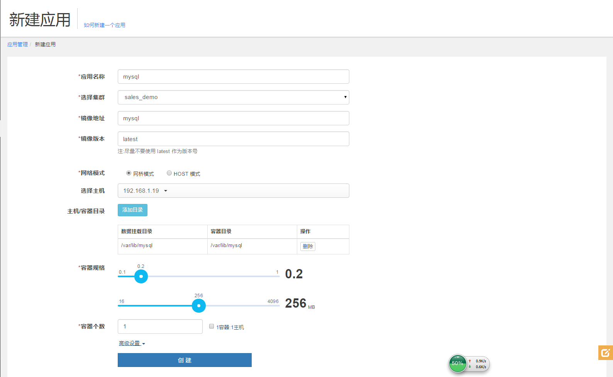
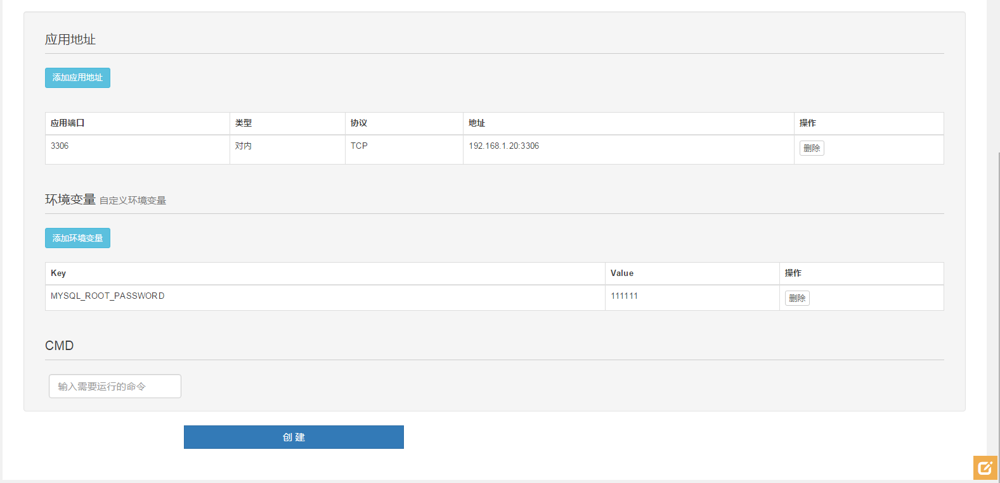
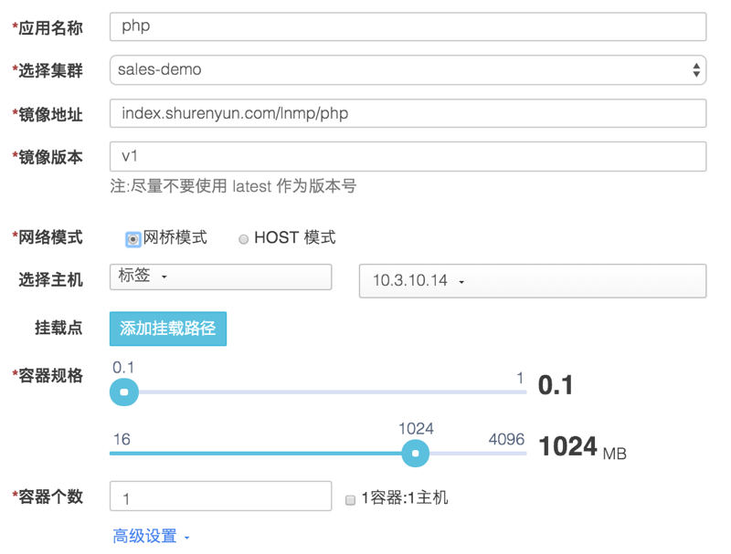
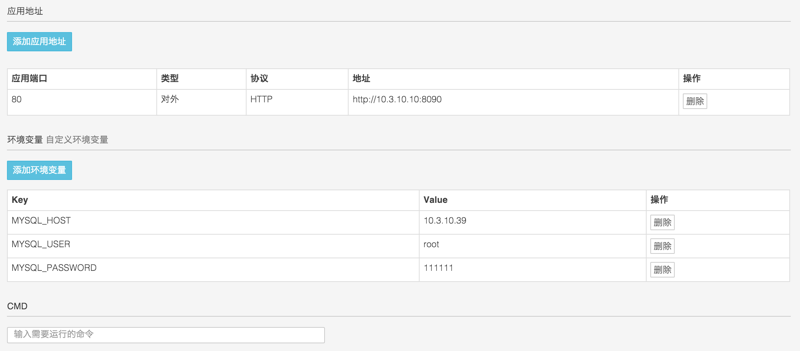

# LNMP-on-shurenyun

LNMP 代表的就是：Linux系统下 Nginx + MySQL + PHP 这种网站服务器架构。

Linux 是一类 Unix 计算机操作系统的统称，本例中选用 Ubuntu 14.04。

Nginx 是一个高性能的 HTTP 服务器和反向代理服务器，也是一个 IMAP/POP3/SMTP 代理服务器，本例选用版本为1.8。

Mysql 是一个小型关系型数据库管理系统，本例中选用版本为5.5。

PHP 是一种在服务器端执行的嵌入 HTML 文档的脚本语言，目前常用版本为5.5。

这四种软件均为免费开源软件 ，组合到一起，成为一个免费、高效、扩展性强的网站服务系统。

## 1 制作 Nginx + PHP 镜像

### 1.1 基础镜像

我们选用 dockerhub 的 octohost/nginx:1.8 这个镜像作为基础镜像。这个镜像已经预装了 Nginx 1.8 版本，并且设置为前台启动。

通过 ```apt-get update``` 更新 apt 的资料列表；

### 1.2 组件安装

#### 1） nginx

导入配置文件```/etc/nginx/sites-available/default```。这里提供一个配置文件模板：

	server {
    	listen 80 default_server backlog=2048;
	
    	root /var/www/my_website;
    	index index.html index.php;
	
	    # Make site accessible from http://localhost/
	    server_name localhost;
	
	    location / {
	        try_files $uri $uri/ /index.php;
	    }
	
	    location ~ \.php$ {
	        fastcgi_split_path_info ^(.+\.php)(/.+)$;
	        # NOTE: You should have "cgi.fix_pathinfo = 0;" in php.ini
	
	        fastcgi_pass unix:/var/run/php5-fpm.sock;
	        fastcgi_param SCRIPT_FILENAME $document_root$fastcgi_script_name;
	        fastcgi_index index.php;
	        include fastcgi_params;
	    }
	}
	
其中，定义了服务器端口为```80```以及网站的根目录为```/var/www/my_website```。

另外，很重要的一点，在```/etc/nginx/nginx.conf```最后一行已经添加了```daemon off;```这一句，表示关闭了 Nginx 后台启动，因此 Nginx 会通过前台启动。

#### 2） PHP 及其组件

添加 PHP5 的安装源并安装 PHP 包括以下组件：

* php5-fpm (PHP FastCGI manager, a patch to the PHP source code, to the FastCGI process management integrated into the PHP package)
* php5-cgi (FastCGI manager that comes with PHP)
* php5-cli (PHP command line)
* php-apc (accelerate the speed of PHP application)
* php5-curl (URL client library function library)
* php5-gd (GD Library Image Library)
* php5-mysql (added MySQL support)
* php5-mcrypt (Mcrypt Encryption Library)
* php5-memcache (Memcache client)
* php5-memcached (Memcache server)
* php5-dev (development support module)

其中，PHP有两个memcache客户端：php5-memcache 和 php5-memcached。php-memcache独立用 PHP 实现，是老客户端，功能少，可设置的属性也少；php5-memcached是基于原生 C 的 libmemcached 的扩展，更加完善，建议使用 php5-memcached。

>若要优化 php5-fpm，则编辑```/etc/php5/fpm/pool.d/www.conf，修改以下取值：  
pm.max_children = 20   
pm.start_servers = 5   
pm.min_spare_servers = 5   
pm.max_spare_servers = 20  
以上参数为在512MB 内存的服务器的推荐取值。

### 1.3 环境变量导入脚本及测试页

这里我们预先放进去一个测试页面，用于测试 LNMP 环境是否部署成功。

在```/var/www/my_website```添加 index.php 文件，内容如下：

	<?php
		$link = mysql_connect($_SERVER['MYSQL_HOST'],$_SERVER['MYSQL_USER'],$_SERVER['MYSQL_PASSWORD']);
        if ($link)
            echo "Success...";
        else
            echo "Failure...";
        mysql_close();
		
		phpinfo();
	?>

其中，```MYSQL_HOST```、```MYSQL_USER```、```MYSQL_PASSWORD```是 PHP 服务器的系统变量，在```fastcgi_params```文件中定义了这些变量。我们希望可以通过环境变量来为它们赋值。

为此，通过一个脚本```start.sh```来定义这些变量，并传入环境变量参数。脚本内容如下：

	#!/bin/bash
	
	sed -i '$a fastcgi_param MYSQL_HOST $MYSQL_HOST;' /etc/nginx/fastcgi_params && sed -i "s/\$MYSQL_HOST/$MYSQL_HOST/" /etc/nginx/fastcgi_params
	sed -i '$a fastcgi_param MYSQL_USER $MYSQL_USER;' /etc/nginx/fastcgi_params && sed -i "s/\$MYSQL_USER/$MYSQL_USER/" /etc/nginx/fastcgi_params
	sed -i '$a fastcgi_param MYSQL_PASSWORD $MYSQL_PASSWORD;' /etc/nginx/fastcgi_params && sed -i "s/\$MYSQL_PASSWORD/$MYSQL_PASSWORD/" /etc/nginx/fastcgi_params

### 1.4 启动指令

通过 CMD 指令执行环境变量导入脚本，启动 PHP ，最后启动 Nginx，具体如下：

	CMD bash /start.sh && service php5-fpm start && nginx
	
完整的 Dockerfile 及所需文件，请见该 Git repo：[LNMP on Shurenyun](http://github.abc.com)

## 2 部署

先部署 MYSQL，使用官方提供的5.5版本的镜像即可，数人云提供了国内镜像下载地址：```index.shurenyun.com/mysql:5.5```。

### 2.1 部署 MYSQL

2.1.1 选择"应用管理"中的"新建应用"

2.1.2 新建应用  

填写应用名称：mysql  

选择集群：your-cluster  

添加应用镜像地址：index.shurenyun.com/mysql  

填写镜像版本：5.5   

网络模式：HOST模式

主机选择：（选定一台主机 IP）
 

容器目录：容器内的挂载目录  /var/lib/mysql

主机目录：主机上的挂载目录  /var/lib/mysql

选择容器规格： CPU：1   内存：512 MB  

  

高级设置：  

填写环境变量参数：
```Key:MYSQL_ROOT_PASSWORD  Value:123456```  

  
填写完成后，点击创建。  

### 2.2 部署 PHP

2.2.1 选择"应用管理"中的"新建应用"

2.2.2 新建应用  

填写应用名称：php  

选择集群：your-cluster  

添加应用镜像地址：index.shurenyun.com/lnmp/php  

填写镜像版本：v1  
  
网络模式：网桥模式

主机选择：（选定一台主机 IP）

选择容器规格： CPU：1   内存：512 MB  

  

高级设置：  

填写应用地址：  端口：8090，类型：对外 HTTP  
选择“对外  HTTP”方式，则该应用会向内部代理注册， 网关对外暴露8090端口；  

填写环境变量参数：  
```Key:MYSQL_HOST      Value:{mysql-ip}```  
```Key:MYSQL_USER      Value:root```  
```Key:MYSQL_PASSWORD  Value:123456```  

  
填写完成后，点击创建。  

## 3 测试

访问外部网关所在主机的8090端口，具体地址见：```http://ip:8090```，若看到以下页面内容，则表示 LNMP 部署已经成功。
